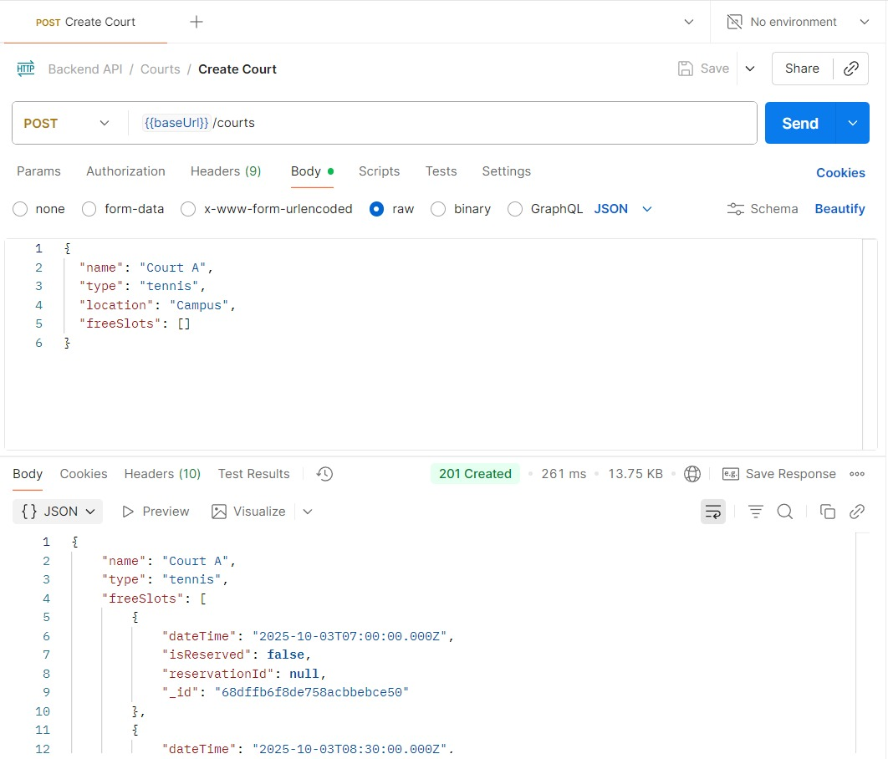
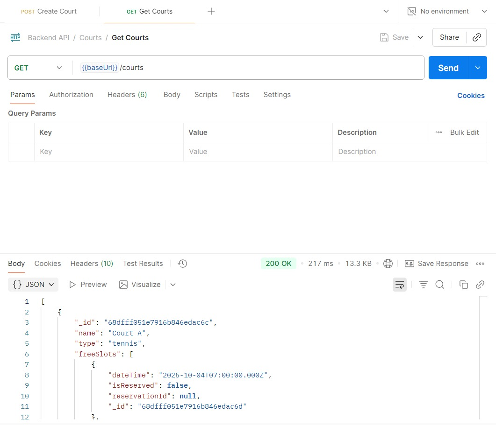

<div align="center">

<h1 style="border-bottom: none;">Zarf Token</h1>

<h3>University Event Management System</h3>

<br>

</div>

A web-based platform designed to streamline the planning, management, and participation of campus events. Zarf Token serves as a centralized hub connecting the events office, students, teaching assistants, staff, faculty, and external vendors to create a seamless event experience across GUC.

## Motivation

Events at GUC nurtures engagement and professional development, but managing them often involves unproductive communication and inefficient processes.

Zarf Token solves these challenges by providing a unified platform that simplifies event management, enables seamless registration, facilitates proposals, streamlines participation, and ensures transparent workflows for all stakeholders.

- Simplifies event creation and management for the events office
- Enables seamless registration and tracking for all university members
- Facilitates academic event proposals and vendor participation
- Implements approval workflows ensuring quality and transparency

## Build Status

**Current Sprint:** Sprint 1 of 3

**Project Progress:** In Active Development

**Completed Features:** 31 system requirements implemented, 27 system requirements tested

**Sprint Overview:**
- Sprint 1 (Current)
- Sprint 2
- Sprint 3

**Status:** Zarf Token is currently in its initial development phase. We are working on establishing the foundational architecture and implementing core system requirements for Sprint 1.

## Known Issues

**Code Quality & Architecture**
- Edge cases are not consistently handled across the codebase
- Legacy code from earlier versions remains in some pages (e.g., `AllEvents.jsx`)
- `MyWorkshops.jsx` and `WorkshopRequests.jsx` inconsistently access backend response data—sometimes using raw values, sometimes through card component functions—resulting in fragmented, difficult-to-maintain code

**Data Synchronization & State Management**
- Only a subset of pages implement auto-refresh (10-second intervals) to reflect backend changes
- Operations on deleted instances (e.g., attempting to edit a removed workshop) are not properly handled and may cause errors

**Data Model**
- The current `Workshop` model conflates all workshop states (Pending, Approved, Rejected). A dedicated `WorkshopRequests` model should be implemented to separate request management from approved workshops

**Notes:** Following Agile methodology, each sprint will deliver a fully functional version with all specified system requirements.

## Code Style

This project follows consistent coding standards to ensure readability and maintainability:

**JavaScript/Node.js:**

**React:** Using functional components with React Hooks, following React best practices

**General Conventions:**
- Meaningful variable and function names using camelCase
- Consistent indentation (2 spaces)
- Comprehensive comments for complex logic

**Git Commit Style:** Conventional Commits format for clear version history

**Color Palette:**
The project uses a carefully selected color palette to ensure visual consistency and brand identity.
- **Primary Colour:** #736CED (Main purple)
- **Secondary Colour:** #6DD3CE (Teal)
- **Accent Colour:** #C14953 (Reddish)
- **Muted Colour:** #D5CFE1 (Soft Background)
- **Info Colour:** #54C6EB (Sky Blue)

**Typography:**
- **Primary Font:** Playfair Display:- Used for headings, titles, and emphasis elements
- **Secondary Fonts:** TBD:- Used for body text, buttons, and UI components

## Screenshots

### Postman:
### Create Court:
<div align="center">
  
  <p><em>Postman CREATE Court Test</em></p>
</div>

### Delete Court:
<div align="center">
  
  <p><em>Postman DELETE Court Test</em></p>
</div>

### Get Court:
<div align="center">
  
  <p><em>Postman GET Court Test</em></p>
</div>

> **Note:** Additional screenshots showcasing different user roles and functionalities will be added as features are completed during the development sprints.

## Tech/Framework Used

**MERN Stack:**

- **MongoDB:-** NoSQL database for flexible data management (Version: v8.2.1)
- **Express.js:-** Backend web application framework (Version: 5.1.0)
- **React.js:-** Frontend library for building user interfaces (Version: 19.1.1)
- **Node.js:-** JavaScript runtime environment (Version: 22.16.0)

**Additional Technologies & Libraries:**

**Backend:**
- TBD

**Frontend:**
- **react-router-dom** - Routing library for React applications
- **qrcode** - QR code generation library
- **lucide-react** - Icon library for React components
- **Tailwind CSS** - Utility-first CSS framework for styling

**Development Tools:**
- Testing framework (TBD)

## Features

We distinguished Zarf Token through comprehensive role-based functionality and amazing workflow management:

**Feature 1:**

**Feature 2:**

**Feature 3:**

**Feature 4:**

**Feature 5:**

## Code Examples

*Code examples will be added to demonstrate key functionality patterns*

**Example: User Authentication (Coming Soon)**
```javascript
// Authentication middleware example
// Code snippet will be added here
```

**Example: Event Creation API (Coming Soon)**
```javascript
// Event creation endpoint example
// Code snippet will be added here
```

**Example: Role-Based Access Control (Coming Soon)**
```javascript
// RBAC implementation example
// Code snippet will be added here
```

## Installation

**Prerequisites:**
- Node.js (v22.16.0)
- MongoDB (Version: v8.2.1)
- npm package manager
- Git

**Step-by-Step Installation Guide:**

1. **Clone the repository**
   ```bash
   git clone [repository-url]
   cd zarf-token
   ```

2. **Install Backend Dependencies**
   ```bash
   cd server
   npm install
   ```

3. **Install Frontend Dependencies**
   ```bash
   cd ../ZarfTokenWebApp
   npm install
   npm install react-router-dom
   npm install qrcode
   npm install lucide-react
   ```

4. **Set up MongoDB database** (Instructions TBD)

5. **Configure environment variables** (Instructions TBD)

6. **Start the Development Servers**
   
   Backend:
   ```bash
   cd server
   npm start
   ```
   
   Frontend:
   ```bash
   cd ZarfTokenWebApp
   npm start
   ```

**Troubleshooting Common Issues:**

If you encounter errors while trying to run the project, follow these steps in order:

1. **First, install dependencies in the frontend (ZarfTokenWebApp):**
   ```bash
   cd ZarfTokenWebApp
   npm install
   ```

2. **Then, install dependencies in the backend (server):**
   ```bash
   cd ../server
   npm install
   ```

3. **If you still get errors, try installing react-router-dom explicitly:**
   ```bash
   cd ../ZarfTokenWebApp
   npm install react-router-dom
   ```

4. **If errors persist, try running the development server anyway** - sometimes the page will render despite warning messages.

5. **Additional troubleshooting steps (if needed):**
   ```bash
   # Clear npm cache
   npm cache clean --force
   
   # Delete node_modules and reinstall (in both frontend and backend directories)
   rm -rf node_modules package-lock.json
   npm install
   ```

## API Reference

**Base URL:** TBD

**Authentication:** TBD

**API Documentation:** TBD

*API documentation will be available covering:*

**Authentication Endpoints:**

**Event Management Endpoints:**
- CRUD operations for events

**User Management Endpoints:**
- Profile management
- Role assignment and permissions
- User verification

**Vendor Endpoints:**
- Company registration
- Documentation management
- Event participation requests

**Admin Endpoints:**
- User validation
- System configuration
- Reporting and analytics

API documentation with request/response examples, error codes, and usage guidelines will be provided as development progresses.

## Tests

**Testing Framework:** TBD

**Testing Strategy:**

*The project will implement comprehensive testing at multiple levels:*

**Unit Tests:**
- Individual function and component testing
- Database model validation

**Integration Tests:**
- API endpoint testing
- Database integration testing

**End-to-End Tests:**
- User workflow testing
- Complete feature path validation

**Test Coverage Goals:**
- Minimum 92% code coverage
- All critical paths tested
- Edge cases and error handling validated

**Running Tests:** TBD

**Test Examples and Commands:** 

## How to Use?

**Getting Started Guide:**

*Step-by-step instructions for different user roles:*

**For Events Office:**
1. Log in with your events office credentials
2. Navigate to "Create Event" from the dashboard
3. Select event type and fill in required details
4. Submit for approval and track status
5. Manage registrations and participants

**For Students/TAs/Staff:**
1. Create an account or log in
2. Browse available events by category, date, or location
3. View detailed event information
4. Register for events you're interested in
5. Track your registered events in "My Events"
6. Receive notifications about event updates

**For Doctors/Faculty:**
1. Log in with faculty credentials
2. Navigate to "Propose Event"
3. Submit workshop or conference proposal
4. Track approval status
5. Manage approved events and participants

**For External Vendors:**
1. Register your company through the vendor portal
2. Upload required documentation
3. Wait for admin verification
4. Browse available bazaars and career fairs
5. Submit participation requests
6. Manage your company profile and events

**For Admins:**
1. Access admin dashboard
2. Review pending user verifications
3. Approve or reject vendor applications
4. Monitor system activity and reports
5. Manage user roles and permissions

**Detailed Usage Instructions:** TBD (Comprehensive user guides with screenshots will be added for each role.)

## Contribute
We welcome contributions from our GUCians!! Whether you're fixing bugs, adding features, or improving documentation, your help is appreciated and encouraged!!

**Areas for Contribution:**
- Address any of the known issues listed above
- Improve edge case handling throughout the codebase
- Refactor legacy code in pages like `AllEvents.jsx`
- Implement consistent data access patterns in `MyWorkshops.jsx` and `WorkshopRequests.jsx`
- Add auto-refresh functionality to remaining pages
- Create a dedicated `WorkshopRequests` model to separate workshop states

**How to Contribute:**
1. **Fork the Repository:** Create your own fork of the project
2. **Create a Branch:** Make a new branch for your feature or bugfix
```bash
   git checkout -b feature/your-feature-name
```
3. **Make Your Changes:** Implement your improvements following our code style guidelines
4. **Test Your Changes:** Ensure all tests pass and add new tests if needed
5. **Commit Your Changes:** Use clear, descriptive commit messages
6. **Push to Your Fork:** Push your changes to your forked repository
7. **Submit a Pull Request:** Open a PR with a clear description of your changes


## Credits

**Development Team (aka Tokeners):**

- Abdelhamid Sameh Abdelhamid
- Ahmed Hamdy Mostafa
- Yehia Wael Raafat
- Ahmed Khalid Mohammed
- Ahmed Mohamed Elsayed
- Ali Ussama Youssef

**Acknowledgments:**

This project was developed under the supervision of Dr. Mervat, following Agile methodology principles.
We would like to sincerely thank:

- Dr. Noha Hamid for her constructive criticism, guidance and support
- ACL TAs for their guidance and support
- All the free online resources
- Open-source community for the amazing tools and frameworks that made this possible

**Inspiration & Resources:**

- MERN Stack documentation and best practices
- The Pragmatic Programmer ~ Andy Hunt and Dave Thomas
- Agile methodology guidelines
- Open-source project management tools

*Additional credits and resources will be added as the project goes on.*

## License

**License Type:**
Distributed under the MIT License. See `LICENSE` for more information.
[](LICENSE)

---

**Project Repository:** TBD

**Documentation:** TBD

**Contact:** For questions or support, please contact our scrum master [Abdelhamid Sameh Abdelhamid].

**Last Updated:** October 2025
