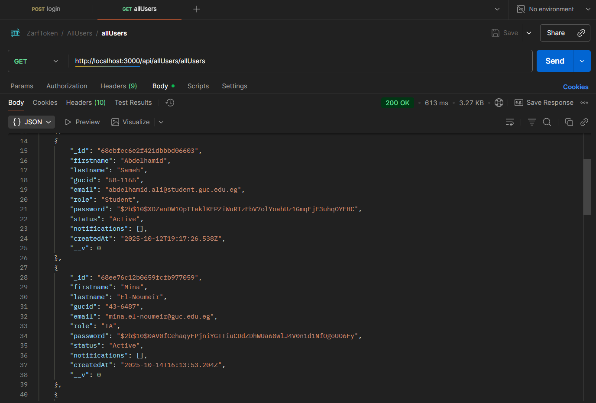
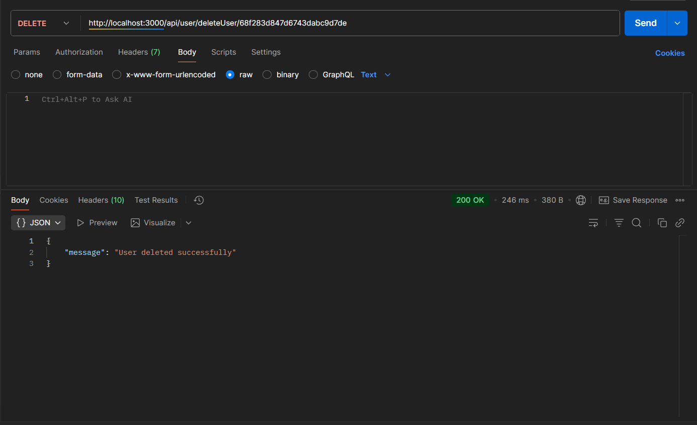
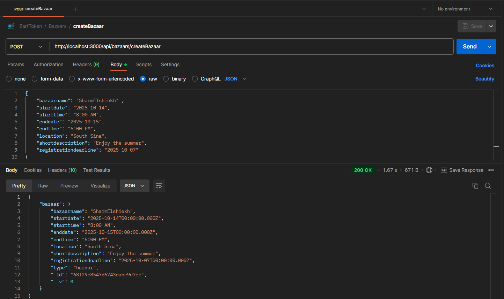
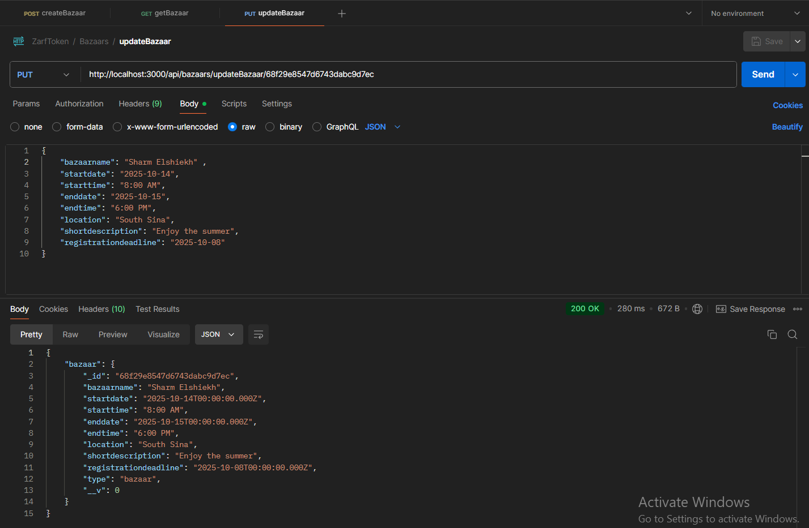
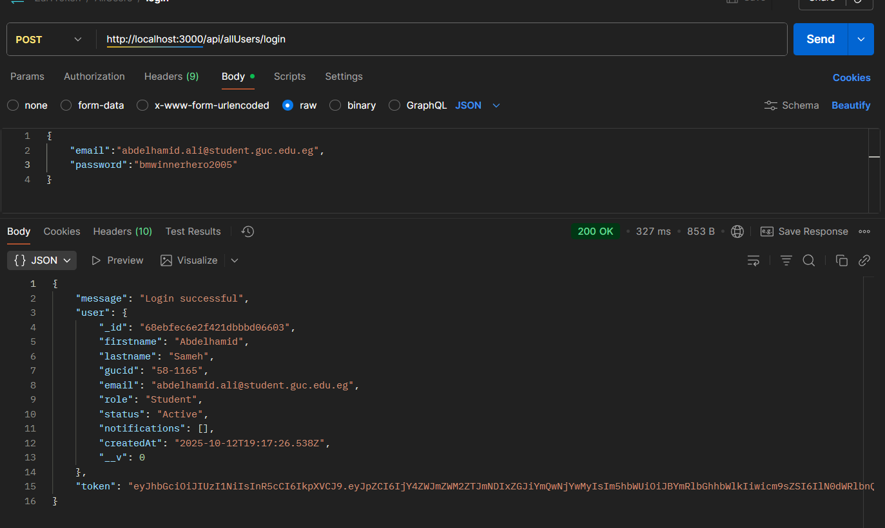

<div align="center">

# Zarf Token

### The best GUC EMS


<br>

</div>

Zarf Token serves as a centralized hub connecting the events office, students, teaching assistants, staff, faculty, and external vendors to create a seamless event experience across GUC. We are a web-based platform designed to streamline the planning, management, and participation of campus events.

## Motivation

Events at GUC nurtures engagement and professional development, but managing them often involves unproductive communication and inefficient processes.

Zarf Token solves these challenges by providing a unified platform that simplifies event management, enables seamless registration, facilitates proposals, streamlines participation, and ensures transparent workflows for all stakeholders.

- Simplifies event creation and management for the events office
- Enables seamless registration and tracking for all university members
- Facilitates academic event proposals and vendor participation
- Implements approval workflows ensuring quality and transparency

## Build Status

**Current Status**
- ~~Sprint 1~~ (Done!)
- ~~Sprint 2~~ (Done!)
- ~~Sprint 3~~ (Done!) 

**Code Quality & Architecture**
- Edge cases are not consistently handled across the codebase
- Legacy code from earlier versions remains in some pages (e.g., `AllEvents.jsx`)
- `MyWorkshops.jsx` and `WorkshopRequests.jsx` inconsistently access backend response data—sometimes using raw values, sometimes through card component functions—resulting in fragmented, difficult-to-maintain code
- All get requests populate objects that might be needed in the future which delays the response.
- Some pages are just useless and can be merged into other pages.
- Some pages are the same for admins and users which is a huge security risk.
- Some pages load a lot of instances at once. It should gradual for better response time.
- May need to add a "go to top of the page" button for better QoL. 
- No specific naming convention used for naming models' fields.

**Data Synchronization & State Management**
- Only a subset of pages implement auto-refresh (10-second intervals) to reflect backend changes
- Operations on deleted instances (e.g., attempting to edit a removed workshop) are not properly handled and may cause errors

**Data Model**
- The current `Workshop` model conflates all workshop states (Pending, Approved, Rejected). A dedicated `WorkshopRequests` model should be implemented to separate request management from approved workshops

## Code Style

This project follows consistent coding standards to ensure readability and maintainability:

**JavaScript/Node.js:**

**React:** Using functional components with React Hooks, following React best practices

**General Conventions:**
- Meaningful variable and function names using camelCase
- Consistent indentation (2 spaces)
- Comprehensive comments for complex logic

**Color Palette:**
The project uses a carefully selected color palette to ensure visual consistency and brand identity.

- **Header Background & Main Text:** `#001845` 🟦
- **Text & Card Backgrounds:** `#ffffff` ⬜
- **Refresh Button & Interactive Elements:** `#4C3BCF` 🟪
- **Main Heading Text & Primary Branding:** `#ffffff` ⬜

**Typography:**
- **Primary Font:** Playfair Display (Used for headings, titles, and emphasis elements)
- **Secondary Fonts:** Inter (Used for body text, buttons, and UI components)

## Project Demo Video

https://github.com/user-attachments/assets/ad306a79-faec-4f55-ac7f-988e36597b1e

---

## Screenshots (Postman Tests)

### User Management

#### Get All Users
<div align="center">
  
  <p><em>Postman test for fetching all users (GET endpoint)</em></p>
</div>

#### Delete User
<div align="center">
  
  <p><em>Postman test for deleting a user (DELETE endpoint)</em></p>
</div>

---

### Bazaar Management

#### Create Bazaar
<div align="center">
  
  <p><em>Postman test for creating a new bazaar (POST endpoint)</em></p>
</div>

#### Update Bazaar
<div align="center">
  
  <p><em>Postman test for updating an existing bazaar (PUT endpoint)</em></p>
</div>

---

### Authentication

#### Signup Page
<div align="center">
  
  <p><em>Frontend signup allowing new user registration</em></p>
</div>

#### Login Page
<div align="center">
  
  <p><em>Frontend login for existing users</em></p>
</div>

> **Note:**  
> Additional screenshots will be added in upcoming sprints — including event creation, admin dashboard, and vendor workflows.

## Tech/Framework Used

**MERN Stack:**

- **MongoDB** - NoSQL database for flexible data management (Version: v8.2.1)
- **Express.js** - Backend web application framework (Version: 5.1.0)
- **React.js** - Frontend library for building user interfaces (Version: 19.1.1)
- **Node.js** - JavaScript runtime environment (Version: 22.16.0)

**Additional Technologies & Libraries:**

**Backend:**
- **stripe** - Handling credit/debit card payments

**Frontend:**
- **react-router-dom** - Routing library for React applications
- **qrcode** - QR code generation library
- **lucide-react** - Icon library for React components
- **Tailwind CSS** - Utility-first CSS framework for styling

# Zarf Token - Feature List

## Authentication & User Management

### Student/Staff/TA/Professor Registration

- Sign up with GUC email, password, first name, last name, and student/staff ID
- Receive verification email with automatic redirect link to login page
- Login restricted until email verification is completed

### Vendor Registration

- Sign up with email, password, and company name
- Upload tax card and company logo to prove validity

### Admin & Role Management

- Admins assign correct roles to Staff/TA/Professor after registration requests
- Staff/TA/Professor receive verification emails after admin approval
- Admins can create other Admin/Event Office accounts
- Admins can delete Admin/Event Office accounts

### Login & Logout

- All users can login with email and password
- All users can logout successfully
- Admins can block any user
- Admins can view list of all users with details and status (active/blocked)

---

## Event Management

### Event Viewing & Discovery

- View all available upcoming events and their details
- Search events by name (Professor name/Event name) or type
- Filter events by name, location, type, or date
- Sort events by date
- Add events to favorites list (Students/Staff/TA/Professor)
- View favorites list

### Event Types

- **Workshops** - Professor-led educational sessions
- **Trips** - University organized trips
- **Bazaars** - Vendor marketplace events
- **Booths** - Individual vendor booths in platform
- **Conferences** - Academic conferences with external links

### Event Creation & Management

#### Workshops (Professor)

- Create workshops with: name, location (GUC Cairo/Berlin), dates/times, description, agenda, faculty responsible, participating professors, budget, funding source, resources, capacity, registration deadline
- Edit workshop details before publication
- View list of created workshops
- View participant lists and remaining spots
- Receive notifications when workshops are accepted/rejected
- View status and requested edits

#### Trips (Events Office)

- Create trips with: name, location, price, dates/times, description, capacity, registration deadline
- Edit trip details before start date

#### Bazaars (Events Office)

- Create bazaars with: name, dates/times, location, description, registration deadline
- Edit bazaar details before event starts

#### Conferences (Events Office)

- Create conferences with: name, dates/times, description, agenda, website link, budget, funding source, resources
- Edit conference details

### Event Office Capabilities

- Receive notifications for workshop submissions
- Accept, reject, or request edits for workshops
- Archive past events
- Delete events with no registrations
- Export registered attendees to .xlsx sheets (except conferences)
- Restrict events to specific user types
- Generate QR codes for external visitors to bazaars/career fairs

---

## Event Participation

### Registration & Payment

- Register for workshops/trips with name, email, and ID
- Pay via credit/debit card (Stripe) or wallet
- Receive payment receipt via email
- View list of registered events (upcoming and past)
- Cancel registration with refund to wallet (only if 2+ weeks before event)
- View wallet balance and refunded amounts

### Ratings & Comments

- Rate events after attendance (1-5 stars)
- Comment on attended events
- View all ratings and comments on any event
- Receive warning email if comments are deleted for being inappropriate
- Admins can delete inappropriate comments

### Certificates & Notifications

- Receive certificate of attendance via email after completing workshops
- Receive notifications for newly added events
- Receive reminders 1 day and 1 hour before registered events

---

## Vendor Features

### Bazaar & Booth Applications

- View list of upcoming bazaars
- Apply to join bazaars (max 5 attendees, booth size 2x2 or 4x4)
- Apply for platform booth (duration 1-4 weeks, location, size 2x2 or 4x4)
- Upload IDs of attendees
- Receive email notifications for acceptance/rejection
- Pay participation fees within 3 days of acceptance
- Receive payment receipt via email
- Receive QR codes for registered visitors
- Cancel participation before payment
- View upcoming bazaars/booths (accepted requests)
- View pending/rejected requests

### Loyalty Program

- Apply to GUC loyalty program with discount rate, promo code, terms & conditions
- Cancel loyalty program participation
- All users can view partner vendors with discounts and promo codes
- Students/Staff receive notifications for new loyalty partners

### Vendor Request Management (Events Office/Admin)

- Receive notifications for pending vendor requests
- View vendor participation request details
- View/download uploaded documents
- Accept or reject vendor requests

---

## Sports & Recreation

### Court Reservations (Students)

- View all courts (basketball/tennis/football) and availability
- Reserve courts from available time slots
- Automatic inclusion of student name and GUC ID

### Gym Sessions

- View monthly gym schedule (yoga, pilates, aerobics, Zumba, cross circuit, kickboxing)
- Register to attend sessions
- Receive notifications for cancelled or edited sessions

#### Gym Management (Events Office)

- Create gym sessions with: date, time, duration, type, max participants
- Edit gym session date, time, and duration
- Cancel gym sessions

---

## Polling System

### Vendor Polls

- Events Office creates polls for vendor booth setup during overlapping durations
- Students/Staff/TA/Professor vote for preferred vendors

---

## Reporting & Analytics (Events Office/Admin)

### Attendance Reports

- View total number of attendees in events
- Filter by event name, type, or date

### Sales Reports

- View revenue from all events
- Filter by event type and/or date
- Sort by revenue (ascending or descending)

---

## Notification System

- System notifications for new events
- Event reminders (1 day and 1 hour prior)
- Workshop approval/rejection notifications (Professors)
- Vendor request acceptance/rejection emails
- Payment receipts via email
- Gym session cancellation/edit notifications
- Loyalty program updates
- Inappropriate comment warnings
- Pending vendor request alerts (Events Office/Admin)

---

## Security & Validation

- Email verification required for all users
- GUC email mandatory for students/staff/TA/professors
- Tax card and logo validation for vendors
- ID verification for bazaar/booth attendees
- Admin role assignment for Staff/TA/Professor
- User blocking capability


## Code Examples

*Code examples demonstrating key functionality patterns*

**Example: Deleting a Bazaar**
```javascript
const deleteBazaar = async (req, res, next) => {
  try {
    const { id } = req.params;
    await Bazaar.findByIdAndDelete(id);
    await Booth.deleteMany({ bazaarId: id });
    return res.json({ message: "bazaar is deleted successfully" });
  } catch (err) {
    next(err);
  }
};
```

**Example: Getting All Courts**
```javascript
export const getCourts = async (req, res) => {
  const courts = await Court.find();
  res.json(courts);
};
```

**Example: Getting All Bazaar Booths**
```javascript
export const getAllBazarsBooths = async (req, res) => {
  try {
    const booths = await Booth.find({ isBazarBooth: true })
      .populate("vendorId")
      .populate("bazarId");
    res.json(booths);
  } catch (err) {
    res.status(500).json({ error: err.message });
  }
};
```

**Example: Registration to event modal**
```javascript
const RegistrationModal = ({
  registerModalEvent,
  regName,
  setRegName,
  regEmail,
  setRegEmail,
  regGucid,
  setRegGucid,
  regError,
  regLoading,
  onClose,
  onSubmit,
}) => {
  if (!registerModalEvent) return null;

  return (
    <div className="fixed inset-0 bg-black/30 backdrop-blur-sm flex items-center justify-center z-50 p-4">
      <div className="bg-white rounded-2xl max-w-md w-full p-6">
        <div className="flex justify-between items-center mb-4">
          <h2 className="text-xl font-bold text-[#4C3BCF]">
            Register for {getEventDetails(registerModalEvent).name}
          </h2>
          <button
            onClick={onClose}
            className="text-gray-500 hover:text-gray-700 text-2xl"
          >
            <X size={24} />
          </button>
        </div>
        {regError && <p className="text-sm text-red-500 mb-2">{regError}</p>}
        <div className="space-y-3">
          <input
            value={regName}
            onChange={(e) => setRegName(e.target.value)}
            placeholder="Full name"
            className="w-full px-4 py-2 border rounded-md"
          />
          <input
            value={regEmail}
            onChange={(e) => setRegEmail(e.target.value)}
            placeholder="Email"
            className="w-full px-4 py-2 border rounded-md"
          />
          <input
            value={regGucid}
            onChange={(e) => setRegGucid(e.target.value)}
            placeholder="GUC ID"
            className="w-full px-4 py-2 border rounded-md"
          />
        </div>
        <div className="mt-6 flex justify-end gap-3">
          <button
            onClick={onClose}
            className="px-4 py-2 rounded-full border hover:bg-gray-100"
          >
            Cancel
          </button>
          <button
            onClick={onSubmit}
            disabled={regLoading}
            className="px-4 py-2 rounded-full bg-[#4C3BCF] text-white hover:bg-[#002966] disabled:opacity-50"
          >
            {regLoading ? "Submitting..." : "Submit"}
          </button>
        </div>
      </div>
    </div>
  );
};
```

**Example: Voting function in Frontend**
```javascript
const vote = async (pollId, boothId) => {
    try {
      await api.post("/polls/vote", { pollId, boothId });
      setSelection((prev) => ({ ...prev, [pollId]: boothId }));
      await refresh();
      setToast({ type: "success", message: "Vote recorded." });
    } catch (e) {
      setError(e?.response?.data?.error || e?.message || "Failed to vote");
      setToast({ type: "error", message: "Could not submit vote." });
    }
  };
```

## Installation

**Prerequisites:**
- Node.js (v22.16.0)
- MongoDB (Version: v8.2.1)
- npm package manager
- Git

**Step-by-Step Installation Guide:**

1. **Clone the repository**
   ```bash
   git clone [repository-url]
   cd zarf-token
   ```

2. **Install Backend Dependencies**
   ```bash
   cd server
   npm install
   ```

3. **Install Frontend Dependencies**
   ```bash
   cd ../ZarfTokenWebApp
   npm install
   npm install react-router-dom
   npm install qrcode
   npm install lucide-react
   ```

4. **Set up MongoDB database** (Instructions TBD)

5. **Configure environment variables** (Instructions TBD)

6. **Start the Development Servers**
   
   Backend:
   ```bash
   cd server
   npm start
   ```
   
   Frontend:
   ```bash
   cd ZarfTokenWebApp
   npm start
   ```

**Troubleshooting Common Issues:**

If you encounter errors while trying to run the project, follow these steps in order:

1. **First, install dependencies in the frontend (ZarfTokenWebApp):**
   ```bash
   cd ZarfTokenWebApp
   npm install
   ```

2. **Then, install dependencies in the backend (server):**
   ```bash
   cd ../server
   npm install
   ```

3. **If you still get errors, try installing react-router-dom explicitly:**
   ```bash
   cd ../ZarfTokenWebApp
   npm install react-router-dom
   ```

4. **If errors persist, try running the development server anyway** - sometimes the page will render despite warning messages.

5. **Additional troubleshooting steps (if needed):**
   ```bash
   # Clear npm cache
   npm cache clean --force
   
   # Delete node_modules and reinstall (in both frontend and backend directories)
   rm -rf node_modules package-lock.json
   npm install
   ```

## API Reference

**Base URL:** http://localhost:3000/api

**Authentication:** /api/auth

**Trips:** /api/trips

**Bazaars:** /api/bazaars

**Conferences:** /api/conferences

**Workshops:** /api/workshops

**All Events:** /api/allEvents

**Polls:** /api/polls

## How to Use?

**Getting Started Guide:**

*Step-by-step instructions for different user roles:*

**For Events Office:**
1. Log in with your events office credentials
2. Navigate to "Create Event" from the dashboard
3. Select event type and fill in required details
4. Submit for approval and track status
5. Manage registrations and participants

**For Students/TAs/Staff:**
1. Create an account or log in
2. Browse available events by category, date, or location
3. View detailed event information
4. Register for events you're interested in
5. Track your registered events in "My Events"
6. Receive notifications about event updates

**For Doctors/Faculty:**
1. Log in with faculty credentials
2. Navigate to "Propose Event"
3. Submit workshop or conference proposal
4. Track approval status
5. Manage approved events and participants

**For External Vendors:**
1. Register your company through the vendor portal
2. Upload required documentation
3. Wait for admin verification
4. Browse available bazaars and career fairs
5. Submit participation requests
6. Manage your company profile and events

**For Admins:**
1. Access admin dashboard
2. Review pending user verifications
3. Approve or reject vendor applications
4. Monitor system activity and reports
5. Manage user roles and permissions

**Detailed Usage Instructions:** TBD (Comprehensive user guides with screenshots will be added for each role.)

## Contribute

We welcome contributions from our GUCians! Whether you're fixing bugs, adding features, or improving documentation, your help is appreciated and encouraged!

**Areas for Contribution:**
- Address any of the known issues listed above
- Improve edge case handling throughout the codebase
- Refactor legacy code in pages like `AllEvents.jsx`
- Implement consistent data access patterns in `MyWorkshops.jsx` and `WorkshopRequests.jsx`
- Add auto-refresh functionality to remaining pages
- Create a dedicated `WorkshopRequests` model to separate workshop states

**How to Contribute:**
1. **Fork the Repository:** Create your own fork of the project
2. **Create a Branch:** Make a new branch for your feature or bugfix
```bash
   git checkout -b feature/your-feature-name
```
3. **Make Your Changes:** Implement your improvements following our code style guidelines
4. **Test Your Changes:** Ensure all tests pass and add new tests if needed
5. **Commit Your Changes:** Use clear, descriptive commit messages
6. **Push to Your Fork:** Push your changes to your forked repository
7. **Submit a Pull Request:** Open a PR with a clear description of your changes

## Credits

**Development Team (aka Tokeners):**

- Abdelhamid Sameh Abdelhamid
- Ahmed Hamdy Mostafa
- Yehia Wael Raafat
- Ahmed Khalid Mohammed
- Ahmed Mohamed Elsayed
- Ali Ussama Youssef

**Acknowledgments:**

This project was developed under the supervision of Dr. Mervat, following Agile methodology principles.
We would like to sincerely thank:

- Dr. Noha Hamid for her constructive criticism, guidance and support
- ACL TAs for their guidance and support
- All the free online resources
- Open-source community for the amazing tools and frameworks that made this possible
- This amazing React crash course made by @programmingwithmosh
https://youtu.be/SqcY0GlETPk?si=fn9R_sJL4msuLkL0

**Inspiration & Resources:**

- MERN Stack documentation and best practices
- The Pragmatic Programmer ~ Andy Hunt and Dave Thomas
- Agile methodology guidelines
- Open-source project management tools

*Additional credits and resources will be added as the project goes on.*

## License

**License Type:**
Distributed under the MIT License. See `LICENSE` for more information.

**Third-Party Licenses:**
- Stripe - Stripe API and SDK are licensed under the Stripe Terms of Service. See `Stripe` for more information.

[](LICENSE)
[](https://stripe.com)

---

**Project Repository:** TBD

**Contact:** For questions or support, please contact our scrum master Abdelhamid Sameh.

**Last Updated:** December '25
